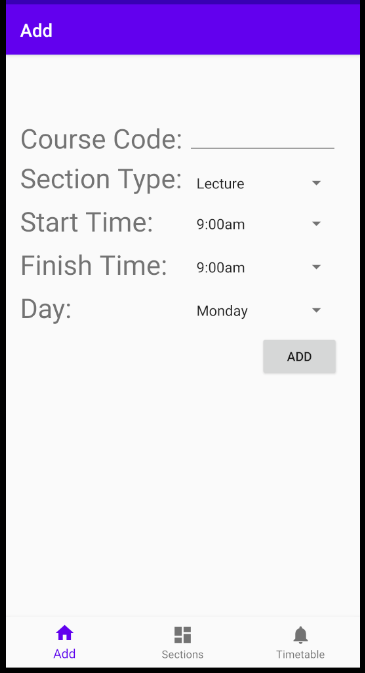

## Overview
timetable-builder is an android app which assists university students in creating their semestre timetables. It uses a graph ADT and pathfinding algorithm to compute a subset of sections such that the total downtime between them is minimized.

## Table of Contents
- [Overview](#overview)
- [Table of Contents](#table-of-contents)
- [Usage](#usage)
  - [Add Tab](#add-tab)
  - [Sections Tab](#sections-tab)
  - [Timetable Tab](#timetable-tab)

## Usage

# Add Tab

Users input section information such as the associated course code, type, start and end times, and day using the graphical user interface.

# Sections Tab

# Timetable Tab
